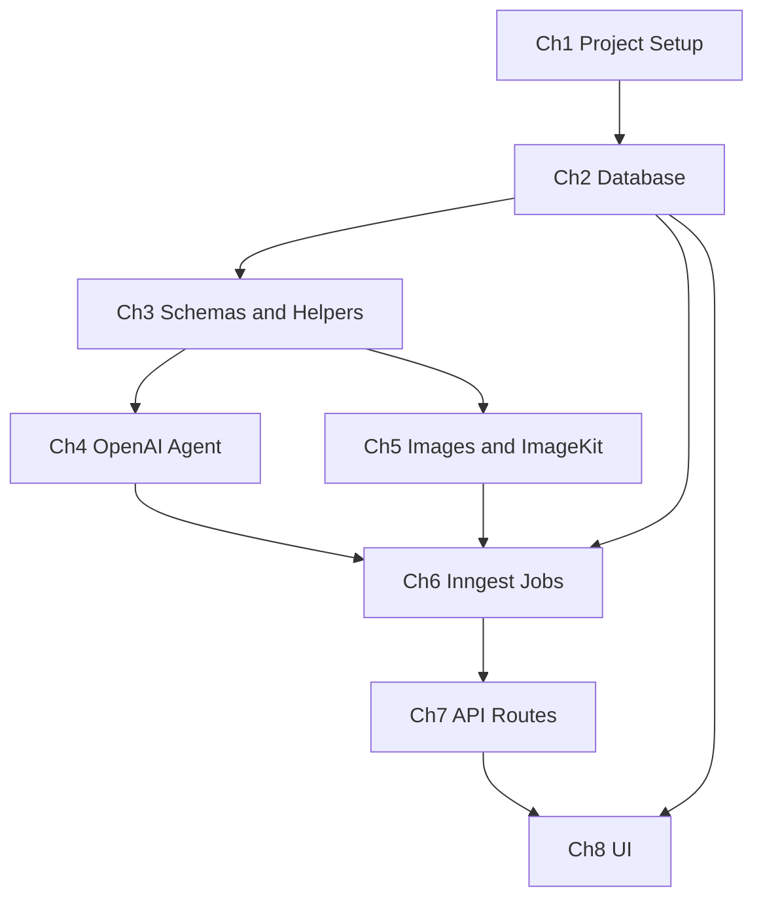

# AI Pitch Deck — Build Chapters

A step-by-step guide to building this app from scratch. Each chapter builds on the previous one — follow them in order.

> **What you're building:** A user submits a startup idea → an AI agent generates structured slide content → OpenAI creates images → ImageKit hosts them → Inngest runs everything in the background → the UI shows a slide carousel.

---

## Architecture at a Glance

```
User (browser)
    │
    ▼
┌─────────────────────────────────────────────────────────┐
│  UI  (app/page.tsx, app/decks/*)                        │
│  CreateDeckForm → DeckViewer (polls every 3s)             │
└──────────────────────────┬──────────────────────────────┘
                           │ fetch
                           ▼
┌─────────────────────────────────────────────────────────┐
│  API  (app/api/decks/*)                                 │
│  POST creates Deck → sends Inngest event                │
│  GET returns deck + slides                              │
└──────────────────────────┬──────────────────────────────┘
                           │ inngest.send("deck/generate")
                           ▼
┌─────────────────────────────────────────────────────────┐
│  Inngest  (lib/inngest/functions/generate-deck.ts)      │
│  Step 1: run AI agent                                   │
│  Step 2: generate image per slide                       │
│  Step 3: upload to ImageKit → save to Postgres          │
└──────┬──────────────────────┬───────────────────────────┘
       │                      │
       ▼                      ▼
┌──────────────┐      ┌──────────────────┐
│ OpenAI Agent │      │ OpenAI Images +  │
│ + Guardrails │      │ ImageKit CDN     │
└──────────────┘      └──────────────────┘
       │                      │
       └──────────┬───────────┘
                  ▼
         ┌────────────────┐
         │ Prisma + Neon  │
         │ Deck / Slide   │
         └────────────────┘
```

---


## Chapter Map


| Chapter                                                     | Topic                       | Key output                                     |
| ----------------------------------------------------------- | --------------------------- | ---------------------------------------------- |
| [1](#chapter-1--project-setup--environment)                 | Project setup & environment | Next.js app + all packages installed           |
| [2](#chapter-2--database-integration-prisma)                | Database (Prisma)           | `Deck` and `Slide` models in Postgres          |
| [3](#chapter-3--schemas--service-helpers)                   | Schemas & service helpers   | Zod schema, OpenAI/ImageKit/Inngest clients    |
| [4](#chapter-4--openai-agent-guardrails--structured-output) | OpenAI Agent                | Guardrails + structured pitch deck JSON        |
| [5](#chapter-5--image-generation--imagekit)                 | Images                      | OpenAI `gpt-image` → ImageKit upload           |
| [6](#chapter-6--inngest-background-jobs)                    | Inngest                     | Background job orchestrating the full pipeline |
| [7](#chapter-7--api-routes)                                 | API routes                  | `POST /api/decks`, `GET /api/decks/[id]`       |
| [8](#chapter-8--ui-pages--components)                       | UI                          | Home form, deck list, slide carousel           |


---


## Chapter 1 — Project Setup & Environment


### Goal

Bootstrap a Next.js app and install every package the project needs.

### Prerequisites

- Node.js 20+
- pnpm installed
- Accounts (can set up later): [OpenAI](https://platform.openai.com), [Neon](https://neon.tech), [ImageKit](https://imagekit.io), [Inngest](https://inngest.com) (optional for local dev)


### Agenda

- [ ] Create Next.js app with App Router + TypeScript + Tailwind
- [ ] Install core dependencies
- [ ] Add npm scripts for database and Inngest
- [ ] Create `.env.example` documenting all required variables


### Packages to add

**Production dependencies:**

```bash
pnpm add @openai/agents zod inngest @imagekit/nodejs openai \
  @prisma/client @prisma/adapter-pg pg dotenv
```

**Dev dependencies:**

```bash
pnpm add -D prisma inngest-cli
```

> UI packages (`@shadcn/react`, `embla-carousel-react`, etc.) come from the initial Next.js + shadcn scaffold.


### Files to create / modify


| Action | Path                              | Purpose                           |
| ------ | --------------------------------- | --------------------------------- |
| Modify | `[package.json](../package.json)` | Add scripts below                 |
| Create | `[.env.example](../.env.example)` | Document all env vars             |
| Create | `[.env](../.env)`                 | Your local secrets (never commit) |


**Scripts to add in** `package.json`**:**

```json
"db:generate": "prisma generate",
"db:migrate": "prisma migrate dev",
"db:studio": "prisma studio",
"inngest:dev": "npx inngest-cli@latest dev",
"test:agent": "pnpm dlx tsx scripts/test-agent.ts"
```

**Environment variables (**`.env.example`**):**

```
DATABASE_URL=
OPENAI_API_KEY=
IMAGEKIT_PUBLIC_KEY=
IMAGEKIT_PRIVATE_KEY=
IMAGEKIT_URL_ENDPOINT=
INNGEST_EVENT_KEY=          # optional for local dev
INNGEST_SIGNING_KEY=        # optional for local dev
# USE_PLACEHOLDER_IMAGES=true   # dev shortcut — skip paid image API
```


### Verify

```bash
pnpm install
pnpm dev   # → http://localhost:3000
```


### Connects to

**Chapter 2** — you'll point `DATABASE_URL` at Neon and define Prisma models.

---


## Chapter 2 — Database Integration (Prisma)


### Goal

Define `Deck` and `Slide` models and persist pitch deck data in Postgres.

### Prerequisites

- Chapter 1 complete
- Neon Postgres database created (`DATABASE_URL` in `.env`)


### Agenda

- [ ] Define `DeckStatus` enum and two models in Prisma schema
- [ ] Configure Prisma 7 with driver adapter
- [ ] Run first migration
- [ ] Create a shared Prisma client singleton


### Packages

Already installed in Chapter 1:

- `prisma`, `@prisma/client`, `@prisma/adapter-pg`, `pg`


### Files to create / modify


| Action    | Path                                              | Purpose                                |
| --------- | ------------------------------------------------- | -------------------------------------- |
| Modify    | `[prisma/schema.prisma](../prisma/schema.prisma)` | `Deck`, `Slide`, `DeckStatus`          |
| Create    | `[prisma7.config.ts](../prisma7.config.ts)`       | Prisma 7 config (reads `DATABASE_URL`) |
| Create    | `[lib/db.ts](../lib/db.ts)`                       | Prisma client singleton                |
| Generated | `lib/generated/prisma/`                           | Auto-generated client (gitignored)     |
| Generated | `prisma/migrations/`                              | Migration SQL files                    |


**Data model:**

```
Deck (1) ──< Slide (many)

Deck:  id, idea, title, status, errorMessage, timestamps
Slide: id, deckId, order, title, content, imagePrompt, imageUrl
```

**Status flow:** `PENDING` → `GENERATING` → `COMPLETE` or `FAILED`

### Commands

```bash
./node_modules/.bin/prisma migrate dev --name init
./node_modules/.bin/prisma generate
pnpm db:studio   # browse tables visually
```


### Verify

Open Prisma Studio — you should see empty `Deck` and `Slide` tables.

### Connects to

- **Chapter 6** — Inngest job reads/writes these tables
- **Chapter 7** — API routes create and fetch decks
- **Chapter 8** — UI displays deck status and slides

---


## Chapter 3 — Schemas & Service Helpers


### Goal

Create shared Zod schemas and small helper modules before wiring AI or background jobs.

### Prerequisites

- Chapter 2 complete


### Agenda

- [ ] Define the pitch deck Zod schema (used as Agent `outputType`)
- [ ] Create OpenAI client for image generation
- [ ] Create ImageKit upload helper
- [ ] Create Inngest client


### Packages

Already installed in Chapter 1:

- `zod`, `openai`, `@imagekit/nodejs`, `inngest`


### Files to create


| Path                                                        | Purpose                                             |
| ----------------------------------------------------------- | --------------------------------------------------- |
| `[lib/schemas/pitch-deck.ts](../lib/schemas/pitch-deck.ts)` | Zod schema — enforces slide JSON shape              |
| `[lib/openai.ts](../lib/openai.ts)`                         | `generateSlideImage(prompt)` via `gpt-image-1-mini` |
| `[lib/imagekit.ts](../lib/imagekit.ts)`                     | `uploadSlideImage(buffer, fileName)`                |
| `[lib/inngest/client.ts](../lib/inngest/client.ts)`         | Inngest client + `deck/generate` event type         |


`PitchDeckSchema` **shape:**

```typescript
{
  deckTitle: string,       // 3–100 chars
  slides: [                // 5–8 slides
    {
      title: string,
      content: string,     // bullet points as text
      imagePrompt: string, // used by OpenAI image API
    }
  ]
}
```


### Verify

No runtime test yet — files should import without errors.

### Connects to

- **Chapter 4** — `PitchDeckSchema` becomes the Agent `outputType`
- **Chapter 5** — `generateSlideImage` + `uploadSlideImage` used per slide
- **Chapter 6** — `inngest` client sends/receives events

---


## Chapter 4 — OpenAI Agent (Guardrails + Structured Output)


### Goal

Build the AI brain: turn a project idea into typed pitch deck JSON, with input/output guardrails.

> This is the **core learning chapter** — it demonstrates structured output and guardrails.


### Prerequisites

- Chapter 3 complete (`PitchDeckSchema` exists)
- `OPENAI_API_KEY` in `.env`


### Agenda

- [ ] Create the main pitch deck agent with `outputType: PitchDeckSchema`
- [ ] Add a **rule-based input guardrail** (idea must be ≥ 20 chars)
- [ ] Add an **LLM-based output guardrail** (quality checker agent)
- [ ] Wrap everything in a `generatePitchDeck()` function
- [ ] Add a test script to verify in isolation


### Packages

Already installed:

- `@openai/agents`, `zod`


### Files to create


| Path                                                                        | Purpose                              |
| --------------------------------------------------------------------------- | ------------------------------------ |
| `[lib/agents/guardrails.ts](../lib/agents/guardrails.ts)`                   | Input + output guardrail definitions |
| `[lib/agents/pitch-deck-agent.ts](../lib/agents/pitch-deck-agent.ts)`       | Main agent config                    |
| `[lib/agents/generate-pitch-deck.ts](../lib/agents/generate-pitch-deck.ts)` | Public `generatePitchDeck()` API     |
| `[scripts/test-agent.ts](../scripts/test-agent.ts)`                         | CLI test script                      |


**Three layers explained:**


| Layer             | File                  | What it does                                         |
| ----------------- | --------------------- | ---------------------------------------------------- |
| Structured output | `pitch-deck-agent.ts` | Forces JSON to match `PitchDeckSchema`               |
| Input guardrail   | `guardrails.ts`       | Blocks short/invalid ideas **before** AI runs        |
| Output guardrail  | `guardrails.ts`       | Quality-checker agent reviews deck **after** AI runs |


### Verify

```bash
# Happy path
pnpm test:agent "A B2B SaaS for automated invoice reconciliation"

# Input guardrail should block this
pnpm test:agent "hi"
```


### Connects to

- **Chapter 6** — Inngest calls `generatePitchDeck()` inside `step.run("run-agent")`
- **Chapter 7** — API validates idea length (same 20-char rule as input guardrail)

---


## Chapter 5 — Image Generation & ImageKit


### Goal

Generate a slide image with OpenAI and host it on ImageKit CDN.

### Prerequisites

- Chapter 3 complete (`lib/openai.ts`, `lib/imagekit.ts`)
- `OPENAI_API_KEY`, `IMAGEKIT_PRIVATE_KEY` in `.env`
- Or set `USE_PLACEHOLDER_IMAGES=true` to skip paid APIs during dev


### Agenda

- [ ] Understand the image pipeline: prompt → OpenAI → buffer → ImageKit → URL
- [ ] Test a single image upload manually (optional script)


### Packages

Already installed in Chapter 3:

- `openai`, `@imagekit/nodejs`


### Files (already created in Chapter 3)


| Path                                    | Key function                                   |
| --------------------------------------- | ---------------------------------------------- |
| `[lib/openai.ts](../lib/openai.ts)`     | `generateSlideImage(prompt)` → `Buffer`        |
| `[lib/imagekit.ts](../lib/imagekit.ts)` | `uploadSlideImage(buffer, fileName)` → CDN URL |


**Per-slide flow (used in Chapter 6):**

```
slide.imagePrompt
  → generateSlideImage()     # OpenAI gpt-image-1-mini
  → uploadSlideImage()       # ImageKit /pitch-decks folder
  → save imageUrl in Slide table
```


### Dev shortcut

```bash
# In .env — uses free stock photos instead of OpenAI image API
USE_PLACEHOLDER_IMAGES=true
```


### Connects to

- **Chapter 6** — Inngest loops over slides and calls these two functions per slide

---


## Chapter 6 — Inngest Background Jobs


### Goal

Move the long-running work (AI agent + 5–8 image generations) off the HTTP request into a background job with retries and step visibility.

### Prerequisites

- Chapters 4 and 5 complete
- All env vars set (or `USE_PLACEHOLDER_IMAGES=true`)


### Agenda

- [ ] Create the `generate-deck` Inngest function with `step.run()` steps
- [ ] Expose the Inngest handler at `/api/inngest`
- [ ] Run Inngest dev server alongside Next.js


### Packages

Already installed:

- `inngest`, `inngest-cli` (dev)


### Files to create


| Path                                                                                  | Purpose               |
| ------------------------------------------------------------------------------------- | --------------------- |
| `[lib/inngest/functions/generate-deck.ts](../lib/inngest/functions/generate-deck.ts)` | Main background job   |
| `[lib/inngest/functions/index.ts](../lib/inngest/functions/index.ts)`                 | Re-exports functions  |
| `[app/api/inngest/route.ts](../app/api/inngest/route.ts)`                             | Next.js serve handler |


**Job steps inside** `generate-deck.ts`**:**


| Step name               | What happens                                   |
| ----------------------- | ---------------------------------------------- |
| `load-deck`             | Fetch deck from Postgres                       |
| `mark-generating`       | `status = GENERATING`                          |
| `run-agent`             | `generatePitchDeck(idea)` — Chapter 4          |
| `save-title`            | Save `deckTitle` to DB                         |
| `image-1`, `image-2`, … | Generate + upload each slide image — Chapter 5 |
| `save-slide-1`, …       | Create `Slide` records                         |
| `mark-complete`         | `status = COMPLETE`                            |
| `mark-failed`           | `status = FAILED` + error message (on error)   |


### Run locally

```bash
# Terminal 1
pnpm dev

# Terminal 2
pnpm inngest:dev
# → Inngest UI at http://localhost:8288
```


### Verify

1. Insert a test `Deck` row in Prisma Studio (`idea` ≥ 20 chars, `status = PENDING`)
2. In Inngest UI → send event `deck/generate` with `{ "deckId": "..." }`
3. Watch steps execute in the Inngest dashboard


### Connects to

- **Chapter 7** — API route sends the `deck/generate` event automatically on `POST /api/decks`

---


## Chapter 7 — API Routes


### Goal

Thin HTTP layer: create decks and fetch results. No AI logic here — only orchestration.

### Prerequisites

- Chapters 2 and 6 complete


### Agenda

- [ ] `POST /api/decks` — create deck + trigger Inngest event
- [ ] `GET /api/decks` — list all decks
- [ ] `GET /api/decks/[id]` — fetch one deck with slides


### Packages

No new packages — uses Next.js App Router + existing `inngest` + `prisma`.

### Files to create


| Path                                                            | Methods       | Purpose                 |
| --------------------------------------------------------------- | ------------- | ----------------------- |
| `[app/api/decks/route.ts](../app/api/decks/route.ts)`           | `GET`, `POST` | List + create decks     |
| `[app/api/decks/[id]/route.ts](../app/api/decks/[id]/route.ts)` | `GET`         | Single deck with slides |


`POST /api/decks` **flow:**

```
1. Validate body: { idea: string } (min 20 chars)
2. prisma.deck.create({ idea, status: PENDING })
3. inngest.send({ name: "deck/generate", data: { deckId } })
4. Return { id, status } immediately (201)
```


### Verify

```bash
# Create
curl -X POST http://localhost:3000/api/decks \
  -H "Content-Type: application/json" \
  -d '{"idea": "A B2B SaaS that uses AI to automate invoice reconciliation for mid-size companies"}'

# Poll status
curl http://localhost:3000/api/decks/{id}

# List all
curl http://localhost:3000/api/decks
```


### Connects to

- **Chapter 8** — UI components call these endpoints

---


## Chapter 8 — UI Pages & Components


### Goal

Build a minimal, beginner-friendly interface: submit an idea, watch generation, view slides in a carousel.

### Prerequisites

- Chapter 7 complete
- Both `pnpm dev` and `pnpm inngest:dev` running


### Agenda

- [ ] Home page with idea form
- [ ] Deck list page
- [ ] Deck detail page with polling + carousel
- [ ] Shared header and status badges


### Packages

No new packages — uses existing shadcn components (`Carousel`, `Button`, `Textarea`, etc.).

### Files to create / modify


| Action | Path                                                                      | Purpose                            |
| ------ | ------------------------------------------------------------------------- | ---------------------------------- |
| Create | `[lib/types/deck.ts](../lib/types/deck.ts)`                               | TypeScript types for API responses |
| Create | `[components/site-header.tsx](../components/site-header.tsx)`             | Nav header                         |
| Create | `[components/create-deck-form.tsx](../components/create-deck-form.tsx)`   | Idea form → POST → redirect        |
| Create | `[components/deck-status-badge.tsx](../components/deck-status-badge.tsx)` | Status badge component             |
| Create | `[components/deck-viewer.tsx](../components/deck-viewer.tsx)`             | Polling + carousel                 |
| Modify | `[app/page.tsx](../app/page.tsx)`                                         | Home page                          |
| Create | `[app/decks/page.tsx](../app/decks/page.tsx)`                             | Deck list                          |
| Create | `[app/decks/[id]/page.tsx](../app/decks/[id]/page.tsx)`                   | Deck detail                        |
| Modify | `[app/layout.tsx](../app/layout.tsx)`                                     | App metadata                       |


**UI flow:**

```
/ (home)
  CreateDeckForm → POST /api/decks → redirect to /decks/[id]

/decks/[id]
  DeckViewer polls GET /api/decks/[id] every 3s while GENERATING
  → Spinner while waiting
  → Carousel when COMPLETE
  → Error alert when FAILED

/decks
  Server-rendered list from Prisma (newest first)
```


### Verify

1. Open [http://localhost:3000](http://localhost:3000)
2. Enter a project idea (20+ characters)
3. Click **Generate Pitch Deck**
4. Watch the deck page update automatically
5. See slides in the carousel when complete

---


## Full File Tree (reference)

```
ai-pitch-deck/
├── app/
│   ├── api/
│   │   ├── decks/
│   │   │   ├── route.ts          ← Ch.7  POST + GET list
│   │   │   └── [id]/route.ts     ← Ch.7  GET single deck
│   │   └── inngest/route.ts      ← Ch.6  Inngest handler
│   ├── decks/
│   │   ├── page.tsx              ← Ch.8  Deck list
│   │   └── [id]/page.tsx         ← Ch.8  Deck viewer
│   ├── layout.tsx                ← Ch.8  Root layout
│   └── page.tsx                  ← Ch.8  Home / create form
├── components/
│   ├── create-deck-form.tsx      ← Ch.8
│   ├── deck-status-badge.tsx     ← Ch.8
│   ├── deck-viewer.tsx           ← Ch.8
│   └── site-header.tsx           ← Ch.8
├── lib/
│   ├── agents/
│   │   ├── guardrails.ts         ← Ch.4
│   │   ├── pitch-deck-agent.ts   ← Ch.4
│   │   └── generate-pitch-deck.ts← Ch.4
│   ├── inngest/
│   │   ├── client.ts             ← Ch.3
│   │   └── functions/
│   │       ├── generate-deck.ts  ← Ch.6
│   │       └── index.ts          ← Ch.6
│   ├── schemas/
│   │   └── pitch-deck.ts         ← Ch.3
│   ├── types/
│   │   └── deck.ts               ← Ch.8
│   ├── db.ts                     ← Ch.2
│   ├── imagekit.ts               ← Ch.3 / Ch.5
│   └── openai.ts                 ← Ch.3 / Ch.5
├── prisma/
│   └── schema.prisma             ← Ch.2
├── scripts/
│   └── test-agent.ts             ← Ch.4
├── .env.example                  ← Ch.1
└── package.json                  ← Ch.1
```

---


## Quick Start (all chapters done)

```bash
# 1. Install
pnpm install

# 2. Set up .env (copy from .env.example)
cp .env.example .env
# Fill in: DATABASE_URL, OPENAI_API_KEY, IMAGEKIT_PRIVATE_KEY, etc.

# 3. Database
./node_modules/.bin/prisma migrate dev
./node_modules/.bin/prisma generate

# 4. Run (two terminals)
pnpm dev          # http://localhost:3000
pnpm inngest:dev  # http://localhost:8288
```

---


## Demo Scenarios (learning guardrails)


| Scenario          | Input                                               | Expected result                         |
| ----------------- | --------------------------------------------------- | --------------------------------------- |
| Happy path        | `"A B2B SaaS for automated invoice reconciliation"` | 6–7 slides with images                  |
| Input guardrail   | `"hi"`                                              | Blocked immediately — idea too short    |
| API validation    | Same short idea via UI                              | 400 error before Inngest runs           |
| Failed generation | Invalid/missing API keys                            | Deck status `FAILED` with error message |


---


## What We Intentionally Skip

This is a **learning project**, not production-ready:

- No authentication
- No rate limiting or billing
- No edit/regenerate individual slides
- No PDF/PPTX export
- No WebSockets (polling is used instead)

---


## Chapter Dependency Diagram




